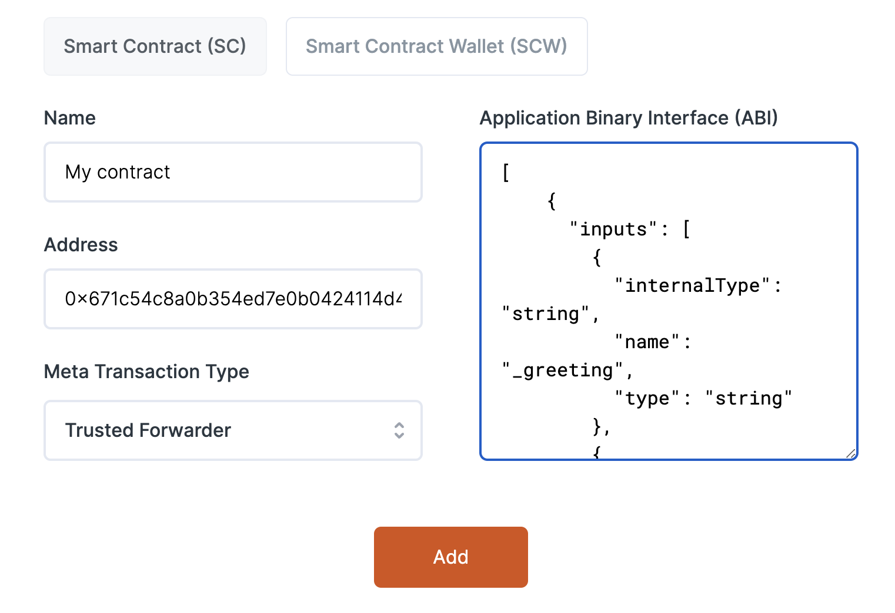

## Gasless transactions via relayer example

This is a basic example project showing how to implement gasless meta-transactions via a Biconomy relayer and [ERC2771Context](https://docs.openzeppelin.com/contracts/4.x/api/metatx).

### Project setup

1. Clone the repo

```sh
git clone git@github.com:dabit3/gasless-transactions-example.git
```

2. Install dependencies

```sh
cd gasless-transactions-example

npm install

# or

yarn
```

3. Configure `PRIVATE_KEY` and `INFURA_ENDPOINT` environment variables.

Also if you are deploying to a network other than Polygon, you can configure that information in `hardhat.config.js`.

4. Compile the project

```sh
npx hardhat compile
```

5. Deploy the smart contract

```sh
npx hardhat run scripts/deploy.js --network polygon
```

6. Update the `greeterAddress` in `pages/index.js`

### Biconomy integration

1. Create an account on [Biconomy](http://biconomy.io)

2. Create a new app. Choose the network you'd like to use (I deployed to Polygon).

3. Enter the smart contact address and ABI (ABI located at `artifacts/contracts/Greeter/Greeter.sol/Greeter.json`)



4. In __Dapp APIs__, add the `setGreeting` function

5. Create a `.env.local` file in the Next.js project and add the Biconomy API Key:

```sh
NEXT_PUBLIC_BICONOMY_API_KEY=your-api-key
```

6. Run the app

```sh
npm start
```

## TLDR for implementing in existing app

1. Update contract to inherit from ERC2771Context

```solidity
pragma solidity ^0.8.9;

import "@openzeppelin/contracts/metatx/ERC2771Context.sol";

contract Greeter is ERC2771Context {}
```

2. `msg.sender -> _msgSender()` - (though this contract does not use `msg.sender`)

3. Configure Biconomy app with contract address and methods you'd like to use

4. Update client-side code to use Biconomy SDKs
